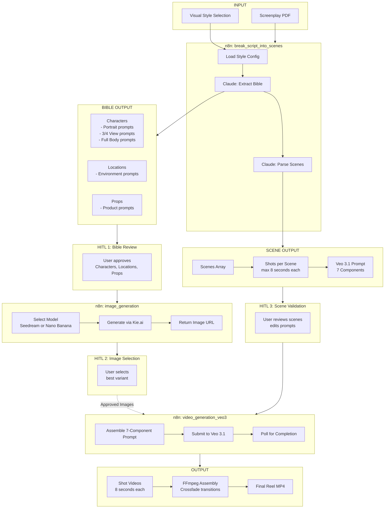
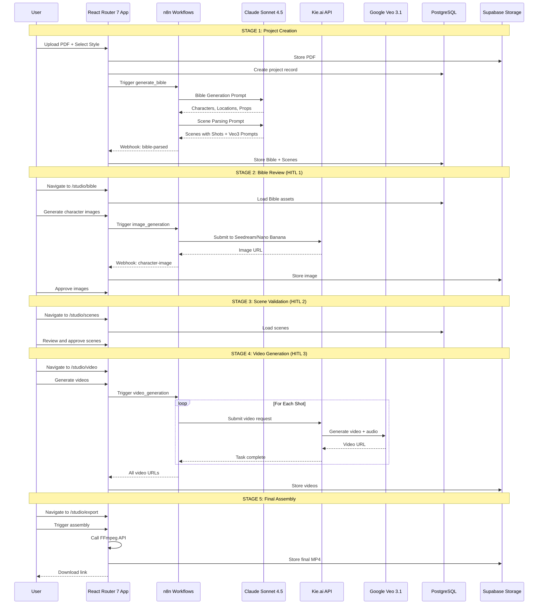
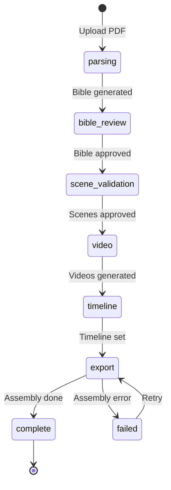
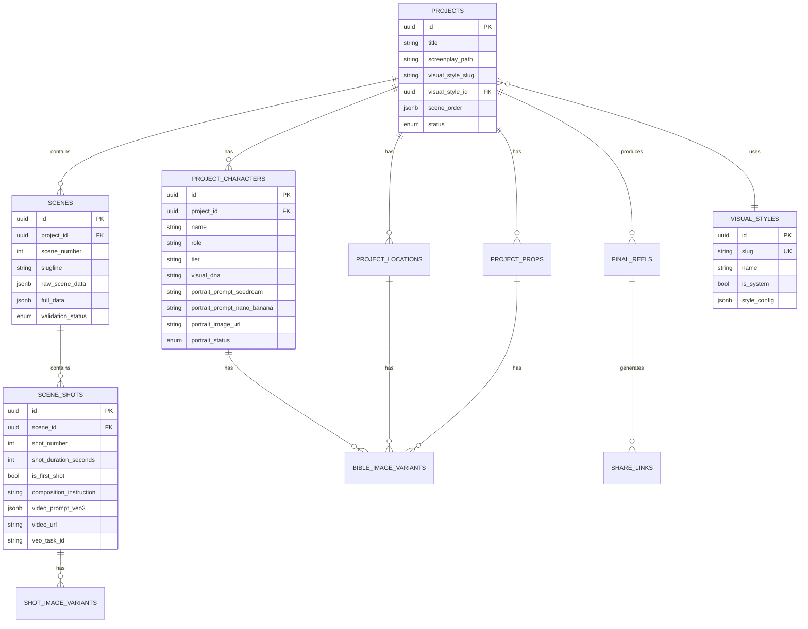
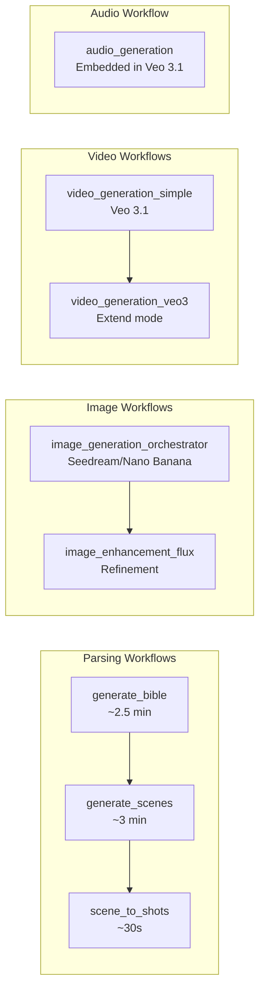
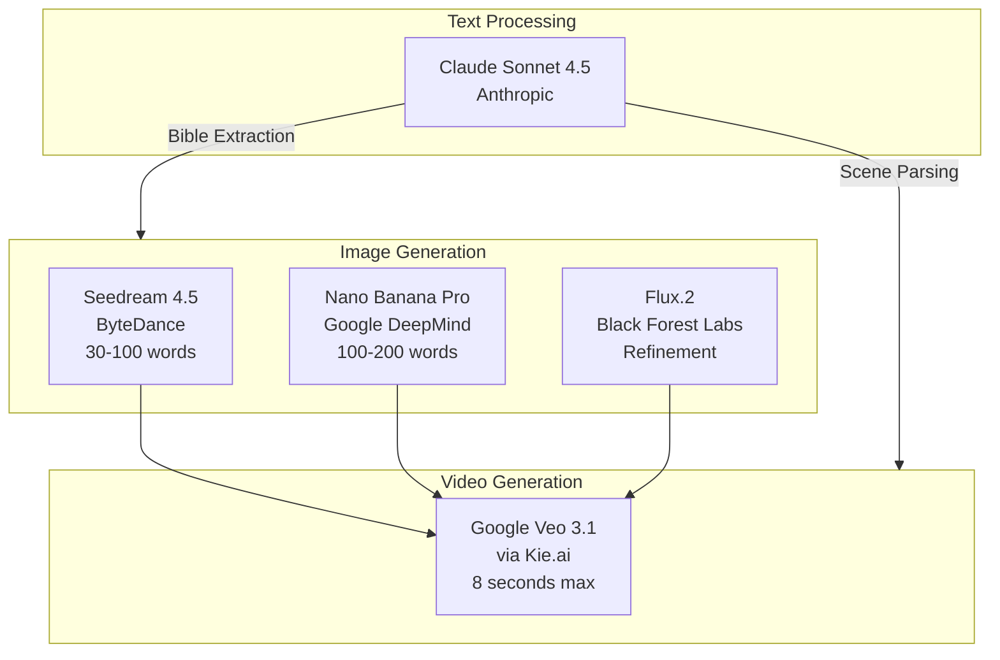
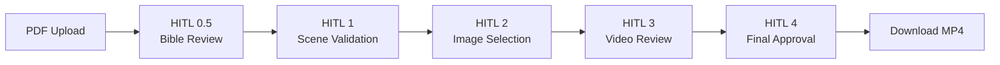

# ripreel.io

**AI-Powered Film Production Tool** - Transform screenplays into professional video pitch reels in under 1 hour (vs 2 weeks + $5,000 traditional cost).

Built for the **n8n Hackathon 2025 in the Early AI Dopters community**.

---

## Table of Contents

1. [Overview](#overview)
2. [Tech Stack](#tech-stack)
3. [Architecture](#architecture)
4. [Key Features](#key-features)
5. [Workflow Pipeline](#workflow-pipeline)
6. [Route Structure](#route-structure)
7. [Database Schema](#database-schema)
8. [n8n Workflow Integration](#n8n-workflow-integration)
9. [Visual Styles System](#visual-styles-system)
10. [AI Models](#ai-models)
11. [Human-in-the-Loop Checkpoints](#human-in-the-loop-checkpoints)
12. [Development Setup](#development-setup)
13. [Project Structure](#project-structure)
14. [External Services](#external-services)

---

## Overview

Upload a screenplay PDF and ripreel.io transforms it into a professional pitch reel through an AI-orchestrated pipeline:

1. **Script Parsing** - AI extracts scenes, characters, locations, and props
2. **Visual Bible** - Generate/upload reference images for character consistency
3. **Scene Images** - Dual-model generation with variant selection
4. **Video Generation** - Image-to-video with Veo 3.1 (includes AI audio)
5. **Timeline Editor** - Drag-and-drop scene reordering
6. **Final Assembly** - FFmpeg stitches videos with crossfade transitions

---

## Tech Stack

| Layer              | Technology                                                         |
| ------------------ | ------------------------------------------------------------------ |
| **Frontend**       | React 19, React Router 7 (Framework Mode), Tailwind CSS, shadcn/ui |
| **Backend**        | Node.js, Drizzle ORM, PostgreSQL                                   |
| **Storage**        | Supabase Storage (PDFs, images, videos)                            |
| **Orchestration**  | n8n workflows (6 specialized workflows)                            |
| **AI Models**      | Claude Sonnet 4.5, Seedream 4.5, Nano Banana Pro, Google Veo 3.1   |
| **Video Assembly** | FFmpeg API Service (crossfade transitions)                         |

> **Note:** This project uses **React Router 7** in framework mode, NOT Next.js.

---

## Architecture

```
                    +----------------------+
                    |  React Router 7 App  |
                    |     (React 19)       |
                    +----------+-----------+
                               |
                +--------------+--------------+
                |                             |
       +--------v--------+         +----------v---------+
       |    Supabase     |         |       n8n          |
       | Storage + Auth  |         |   Orchestration    |
       +-----------------+         +----+----+----+-----+
                                        |    |    |
                      +-----------------+    |    +-----------------+
                      |                      |                      |
             +--------v--------+   +---------v-------+   +----------v-------+
             |  Claude 4.5     |   |  Seedream 4.5   |   |    Veo 3.1       |
             |  (Parsing)      |   |  + Nano Banana  |   |  (Video+Audio)   |
             +-----------------+   +-----------------+   +------------------+
                                                                  |
                                                         +--------v--------+
                                                         |  FFmpeg API     |
                                                         |  (Assembly)     |
                                                         +-----------------+
```

### Application Flow



---

## Key Features

### Human-in-the-Loop (HITL) Checkpoints

- **Bible Review** - Approve character/location references before scene generation
- **Scene Validation** - Edit AI-extracted scenes with inline editing
- **Image Selection** - Choose from multiple AI-generated variants
- **Final Review** - Timeline reordering and export approval

### Parallel Processing

- Dual-model image generation (Seedream 4.5 + Nano Banana Pro simultaneously)
- Batched video generation (RAM-optimized for n8n instance)
- Real-time status polling with visual progress indicators

### Film Production Design System

- Dark cinematic aesthetic with yellow (#f5c518) and red (#e02f2f) accents
- Oswald typography for headers, Courier for technical elements
- Clapper card components and screenplay-style scene cards

---

## Workflow Pipeline

### Detailed Sequence



### Project Status Lifecycle



---

## Route Structure

```
/                              Landing page
/projects                      Projects dashboard
/projects/new                  New project wizard
/projects/:id/studio           Studio layout (parent route)
  /studio/bible               Bible review & approval
  /studio/scenes              Scene validation
  /studio/images              Shot image generation
  /studio/video               Video generation
  /studio/timeline            Timeline reordering
  /studio/export              Final assembly & download
/share/:shareId               Public preview (no auth)
/settings                      API key configuration
```

### File Structure

```
app/
  routes/
    _index.tsx                 # Landing page
    projects._index.tsx        # Projects list
    projects.new.tsx           # New project wizard
    projects.$id.studio.tsx    # Studio layout
    projects.$id.studio.bible.tsx
    projects.$id.studio.scenes.tsx
    projects.$id.studio.images.tsx
    projects.$id.studio.video.tsx
    projects.$id.studio.timeline.tsx
    projects.$id.studio.export.tsx
    api.webhooks.n8n.*.tsx     # n8n webhook handlers
```

---

## Database Schema



### Key Tables

| Table                | Purpose                                       |
| -------------------- | --------------------------------------------- |
| `projects`           | Project metadata, status, scene order         |
| `scenes`             | Parsed screenplay scenes with raw/full data   |
| `scene_shots`        | Shot breakdown with Veo 3.1 prompts           |
| `project_characters` | Bible characters with model-specific prompts  |
| `project_locations`  | Bible locations with prompts                  |
| `project_props`      | Bible props (GENERATE or DESCRIBE)            |
| `visual_styles`      | System and custom visual style configurations |
| `final_reels`        | Assembled video metadata and URLs             |

---

## n8n Workflow Integration

### 8 Specialized Workflows



### Workflow Details

| Workflow                        | ID                 | Purpose                              | Duration |
| ------------------------------- | ------------------ | ------------------------------------ | -------- |
| `generate_bible`                | `Jp286Vtl5SgnFoCi` | Extract characters, locations, props | ~2.5 min |
| `generate_scenes`               | `xsxcipq5geMBFkfv` | Parse scenes with shots              | ~3 min   |
| `image_generation_orchestrator` | `jDyejkSUkUFy39Dk` | Generate images (dual-model)         | ~30-60s  |
| `video_generation_simple`       | `jHtOZ9R8Lut4QB1d` | Veo 3.1 video + audio                | ~60-120s |
| `scene_to_shots`                | `NfCxtVWOW1M3h62I` | AI divide scenes into 8s shots       | ~30s     |
| `video_generation_veo3`         | `9P08lK46cM96q9vE` | Veo 3.1 with extend mode             | ~2-5 min |

### Webhook Endpoints

```
POST /api/webhooks/n8n/bible-parsed        # Bible + raw scenes stored
POST /api/webhooks/n8n/scene-image-variant # Scene image ready
POST /api/webhooks/n8n/shot-image-variant  # Shot image ready
POST /api/webhooks/n8n/bible/character-image
POST /api/webhooks/n8n/bible/location-image
POST /api/webhooks/n8n/bible/prop-image
POST /api/webhooks/n8n/video-generated     # Video ready
```

### Batch Processing & RAM Optimization

The n8n instance has 8GB RAM. Processing is batched accordingly:

| Asset Type | Parallelism         | RAM Usage    |
| ---------- | ------------------- | ------------ |
| Images     | 8 parallel          | ~100MB total |
| Videos     | 2-3 sequential      | ~500MB each  |
| Audio      | Parallel with video | ~200MB each  |

---

## Visual Styles System

Visual styles define the entire aesthetic of the generated content. Each style contains 17 parameters that are injected into all AI prompts.

### Available System Styles

| Style                 | Description                                                   |
| --------------------- | ------------------------------------------------------------- |
| **Classic Film Noir** | B&W, high contrast, shadows, venetian blinds, fatalistic mood |
| **The Godfather**     | Warm amber, low-key lighting, 1970s, operatic tragedy         |
| **Almodovar**         | Bold colors, melodrama, Spanish sensibility                   |

### Style Configuration Parameters

```typescript
interface StyleConfig {
  // Image Generation
  film_stock_prefix: string; // "35mm Kodak Double-X 5222..."
  composition_rules: string; // "dutch angles, low camera..."
  lighting_style: string; // "single-source hard key..."
  color_palette: string; // "pure monochromatic B&W..."
  neutral_background: string; // "pure black gradient..."
  atmosphere_keywords: string; // "fatalistic, cynical..."
  texture_keywords: string; // "silver gelatin, film grain..."
  character_pose_style: string; // "three-quarter view..."
  location_style: string; // "wet pavement, venetian blinds..."
  prop_style: string; // "high contrast B&W..."

  // Video Generation (Veo 3.1)
  camera_movement_style: string; // "slow dolly movements..."
  default_camera_angles: string; // "low angle for power..."
  veo_color_grade: string; // "crushed blacks, high contrast..."
  veo_style_reference: string; // "Double Indemnity, Touch of Evil..."

  // Audio
  music_style: string; // "slow jazz piano, saxophone..."
  narrator_style: string; // "gravelly, world-weary..."
  default_ambient: string; // "rain, thunder, clock ticking..."
}
```

---

## AI Models



### Model Specifications

| Model             | Provider            | Purpose               | Prompt Style             |
| ----------------- | ------------------- | --------------------- | ------------------------ |
| Claude Sonnet 4.5 | Anthropic           | Bible + Scene parsing | Structured instructions  |
| Seedream 4.5      | ByteDance           | Image generation      | 30-100 words, direct     |
| Nano Banana Pro   | Google DeepMind     | Image generation      | 100-200 words, narrative |
| Flux.2            | Black Forest Labs   | Image refinement      | Natural language         |
| Veo 3.1           | Google (via Kie.ai) | Video + Audio         | 7-component structure    |

### Veo 3.1 Prompt Structure

```
SUBJECT: Character description with 15+ attributes

ACTION: What moves in the video (camera, character, objects)

SCENE: Environment, props, lighting details

STYLE: Camera angle with "(that's where the camera is)" syntax

DIALOGUE: "Character says: 'text' with tone" or null

SOUNDS: "Ambient: X. SFX: Y. Foley: Z. Music: or 'No music'."

TECHNICAL: No subtitles, no text overlays, no watermarks
```

---

## Human-in-the-Loop Checkpoints

Ripreel includes 4 human validation points to ensure quality:



| Checkpoint   | Route            | User Actions                                                           |
| ------------ | ---------------- | ---------------------------------------------------------------------- |
| **HITL 0.5** | `/studio/bible`  | Review characters, locations, props. Generate/upload reference images. |
| **HITL 1**   | `/studio/scenes` | Review parsed scenes. Edit descriptions. Approve scenes.               |
| **HITL 2**   | `/studio/images` | Generate image variants. Select best variant per shot.                 |
| **HITL 3**   | `/studio/video`  | Generate videos. Review audio. Approve shots.                          |
| **HITL 4**   | `/studio/export` | Review final assembly. Download or regenerate.                         |

---

## Development Setup

### Prerequisites

- Node.js 20+
- PostgreSQL database
- Supabase project
- n8n instance with 8 configured workflows

### Quick Start

```bash
# Clone the repo
git clone https://github.com/[your-username]/ripreel.git
cd ripreel

# Install dependencies
npm install

# Set up environment variables (Conductor workspace)
vercel link --yes --project ripreel && vercel env pull .env.local

# OR copy environment template manually
cp .env.local.example .env.local

# Run database migrations
npm run db:migrate

# Setup storage buckets
npm run storage:setup

# Start development server
npm run dev
```

### Development Commands

```bash
npm run dev              # Start dev server with Turbopack
npm run build            # Production build
npm run type-check       # TypeScript type checking (tsc --noEmit)
npm run lint             # ESLint
npm run format           # Prettier formatting
```

### Database Commands (Drizzle ORM)

```bash
# Development (uses .env.local)
npm run db:generate        # Generate migrations from schema changes
npm run db:generate:custom # Generate custom SQL migrations (RLS, functions, triggers)
npm run db:migrate         # Run pending migrations
npm run db:rollback        # Rollback last migration (requires down.sql)
npm run db:status          # Check migration status
npm run db:seed            # Seed database with initial data

# Production (uses .env.prod)
npm run db:generate:prod
npm run db:migrate:prod
npm run db:status:prod
```

### Environment Variables

Required in `.env.local`:

```
DATABASE_URL=postgresql://...
SUPABASE_URL=https://your-project.supabase.co
SUPABASE_ANON_KEY=your-anon-key
SUPABASE_SERVICE_ROLE_KEY=your-service-role-key
N8N_MCP_URL=https://your-n8n-instance.com
N8N_MCP_API_KEY=your-n8n-api-key
NEXT_PUBLIC_APP_URL=http://localhost:3000
```

---

## Project Structure

```
ripreel/
├── app/
│   ├── routes/                # React Router 7 routes
│   │   ├── _index.tsx         # Landing page
│   │   ├── projects.*.tsx     # Project routes
│   │   └── api.webhooks.*.tsx # n8n webhooks
│   └── actions/               # Server Actions
├── components/
│   ├── bible/                 # Character/location cards
│   ├── scenes/                # Scene validation UI
│   ├── studio/                # Studio layout components
│   └── ui/                    # shadcn/ui components
├── lib/
│   ├── drizzle/               # Database schema and client
│   ├── n8n/                   # MCP client for n8n
│   └── supabase/              # Supabase client
├── ai_docs/                   # AI development documentation
│   ├── guides/                # Implementation guides
│   ├── n8n_prompts/           # n8n workflow prompts
│   ├── tasks/                 # Task tracking
│   └── fixes/                 # Bug fix documentation
└── docs/                      # User documentation
```

---

## Storage Buckets

| Bucket                     | Purpose                            |
| -------------------------- | ---------------------------------- |
| `pdfs`                     | Original screenplay PDFs           |
| `scene-images`             | Scene-level image variants         |
| `shot-images`              | Shot-level image variants          |
| `bible-characters-uploads` | User-uploaded character references |
| `bible-locations-uploads`  | User-uploaded location references  |
| `bible-props-uploads`      | User-uploaded prop references      |
| `reels`                    | Final assembled MP4 videos         |

---

## External Services

| Service    | URL                                             | Purpose                          |
| ---------- | ----------------------------------------------- | -------------------------------- |
| n8n        | `https://n8n.cutzai.com`                        | Workflow orchestration           |
| Kie.ai     | API                                             | Veo 3.1 + Image generation proxy |
| FFmpeg API | `https://apps-ffmpeg-api.cd8kmo.easypanel.host` | Video assembly                   |
| Supabase   | Project-specific                                | Database + Storage               |

---

## License

MIT License - Built for the n8n x Anthropic Hackathon 2024.

## Credits

Built with AI assistance from Claude.

---

**ripreel.io** - _Turn Your Screenplay Into A Rip Reel_
